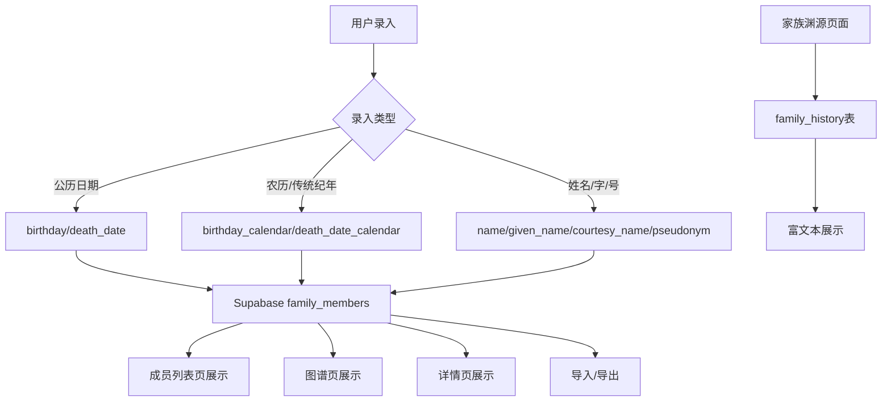

# DESIGN_族谱功能增强

## 1. 数据库架构设计

### 1.1 family_members 表新增字段

```sql
-- 名/字/号字段
ALTER TABLE family_members ADD COLUMN given_name TEXT;        -- 名（大名）
ALTER TABLE family_members ADD COLUMN courtesy_name TEXT;     -- 字
ALTER TABLE family_members ADD COLUMN pseudonym TEXT;         -- 号

-- 农历/传统纪年字段
ALTER TABLE family_members ADD COLUMN birthday_calendar TEXT; -- 农历/传统纪年出生（如"光绪十七年三月初五"）
ALTER TABLE family_members ADD COLUMN death_date_calendar TEXT; -- 农历/传统纪年卒年（如"民国三十三年四月初四日酉时"）
```

### 1.2 新增 family_history 表

```sql
CREATE TABLE family_history (
  id UUID PRIMARY KEY DEFAULT gen_random_uuid(),
  title TEXT NOT NULL DEFAULT '家族渊源',
  content TEXT,                          -- 富文本内容
  updated_at TIMESTAMP WITH TIME ZONE DEFAULT NOW(),
  updated_by UUID REFERENCES auth.users(id)
);
```

## 2. 数据模型变更

### 2.1 FamilyMember 接口变更

```typescript
export interface FamilyMember {
  id: number;
  name: string;                    // 现有：常用名/排序名
  given_name: string | null;       // 新增：名
  courtesy_name: string | null;    // 新增：字
  pseudonym: string | null;        // 新增：号
  generation: number | null;
  sibling_order: number | null;
  father_id: number | null;
  father_name: string | null;
  gender: "男" | "女" | null;
  official_position: string | null;
  is_alive: boolean;
  spouse: string | null;
  remarks: string | null;
  birthday: string | null;         // 现有：公历生日 YYYY-MM-DD
  death_date: string | null;       // 现有：公历卒年 YYYY-MM-DD
  birthday_calendar: string | null; // 新增：农历/传统纪年出生
  death_date_calendar: string | null; // 新增：农历/传统纪年卒年
  residence_place: string | null;
  updated_at: string;
}
```

### 2.2 显示逻辑

**姓名显示格式**（如截图所示）:
```
琴福                    // 主显示名 (name)
名宫福，字佐璜           // 副标题 (given_name + courtesy_name)
26世                    // 世代
```

**日期显示逻辑**:
```
优先显示农历/传统纪年 → 无则显示公历 → 无则显示 "-"
```

## 3. 组件架构设计

### 3.1 修改现有组件

| 文件 | 修改内容 |
|------|----------|
| `app/family-tree/actions.ts` | 新增字段加入接口和CRUD操作 |
| `app/family-tree/graph/actions.ts` | 新增字段加入查询 |
| `app/family-tree/family-members-table.tsx` | 表单新增输入框，表格新增列 |
| `app/family-tree/member-detail-dialog.tsx` | 详情页显示名/字/号和农历日期 |
| `app/family-tree/import-members-dialog.tsx` | Excel模板新增列 |
| `app/family-tree/graph/family-node.tsx` | 图谱节点显示调整 |

### 3.2 新建组件

| 文件 | 说明 |
|------|------|
| `app/family-tree/history/page.tsx` | 家族历史渊源页面 |
| `app/family-tree/history/actions.ts` | 历史内容CRUD操作 |

### 3.3 布局变更

在 `app/family-tree/layout.tsx` 导航栏新增"家族渊源"入口。

## 4. 数据流图



## 5. 界面设计

### 5.1 成员表单新增字段

**姓名区域**（表单顶部）:
```
姓名 *        [琴福]          // name
名            [宫福]          // given_name
字            [佐璜]          // courtesy_name
号            []             // pseudonym
```

**日期区域**:
```
公历生日       [1990-01-01]   // birthday (保留)
农历/传统纪年出生 [光绪十七年] // birthday_calendar
公历卒年       [1944-05-17]   // death_date (保留，在世时隐藏)
农历/传统纪年卒年 [民国三十三年四月初四日酉时] // death_date_calendar
```

### 5.2 成员详情页（书本翻转 - 正面）

```
┌──────────────────────────────┐
│ 👤 琴福                       │
│    名宫福，字佐              │
│    26世                      │
├──────────────────────────────┤
│ 父亲: 未记录   配偶: 凌氏     │
│ 生辰: 光绪十七年              │
│ 卒年: 民国三十三年四月初四酉时 │
│ 居住地: 未记录                │
└──────────────────────────────┘
```

### 5.3 家族历史渊源页面

```
┌──────────────────────────────────────┐
│ 📖 家族渊源                           │
├──────────────────────────────────────┤
│ [富文本编辑器]                        │
│                                      │
│ 张氏源流...                          │
│                                      │
│                    [保存]             │
└──────────────────────────────────────┘
```

## 6. 技术约束

- 不引入新的第三方依赖（日期相关不引入农历转换库）
- 所有日期文本以自由文本存储，不强制格式
- Excel导入模板同步更新所有新字段
- 富文本编辑复用现有的 Slate 编辑器
